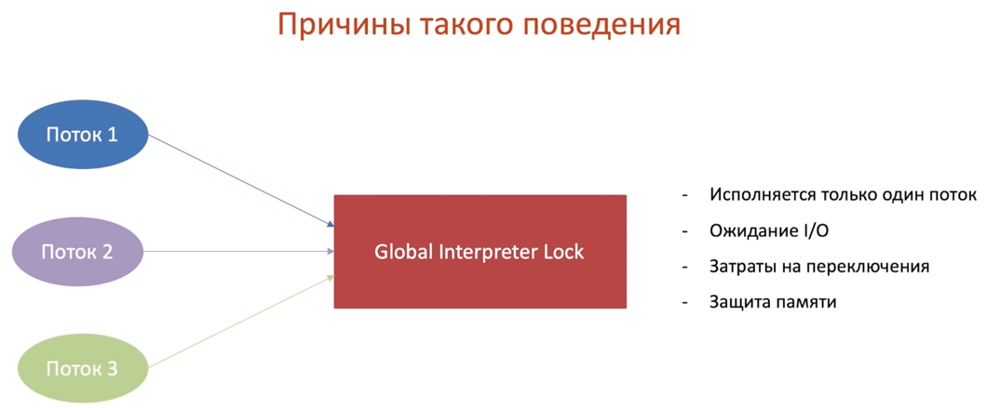

### &#x1F535; Асинхронное и многопоточное программирование 

&#x1F535; GIL  

> Gil

### COGNITO
> Manage Identety pools > name+<pool> > Enable access to unauthenticated identities > allow > Copy Javascript into index.html

### S3