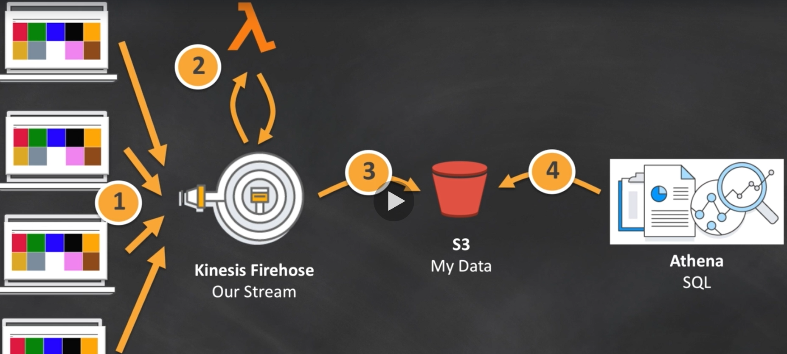
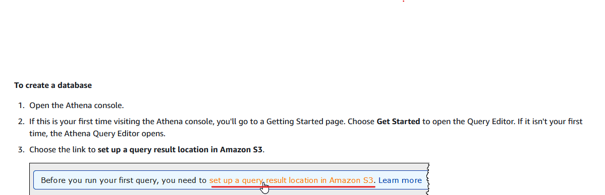
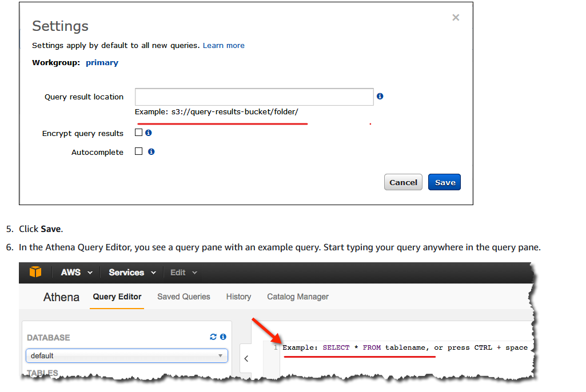

### <span style="color: black">&#x1F535; Data analysis using: AWS KINESIS, S3, LAMBDA, ATHENA, COGNITO </span>


<span style="color: blue">&#x1F535; The scheme  </span>


### COGNITO
> Manage Identety pools > name+<pool> > Enable access to unauthenticated identities > allow > Copy Javascript into index.html

### S3
> Create s3 bucker > Properties > static website hosting (index.html) and COPY THE LINK ! CHECK IT  > upload changed index.html >

> Create analysis s3 bucket for KINESIS

> Create athenadb s3 bucket for ATHENA
###  IAM
> Allow permissions for cognito-pool > IAM roles > cognito-poolAuth

### KINESIS
> Create delivery stream > kinesis-firehose > (BUffer size 1, interval 60) > Create new IAM role (allow) > data/ add analysis s3 bucket


### LAMBDA
> Create new lambda > copy from kinesis_validator.py

### Configure
```
Go to kinesis-firehose > edit > transform source record with AWS LAMBDA > chose your LAMBDA >
!!! IAM role : CREATE NEW OR UPDATE > Allow !!!

```
### Find in analysis s3 bucket results, CHECK IT


### ATHENA
> https://docs.aws.amazon.com/athena/latest/ug/getting-started.html



> Input from athena.txt to new query

```
CREATE EXTERNAL TABLE sampledb.kinesis_data (
  author string,
  value string
 )
 ROW FORMAT SERDE 'org.openx.data.jsonserde.JsonSerDe'
 WITH SERDEPROPERTIES ('ignore.malformed.json' = 'true')
 LOCATION 's3://analysis s3 bucket/data/';

```
You can use:
```
SELECT author, count(*) FROM "sampledb"."kinesis_data" group by author;

```
<span style="color: red">&#x1F535; For details feel free to contact  </span>
### fhause5@gmail.com
